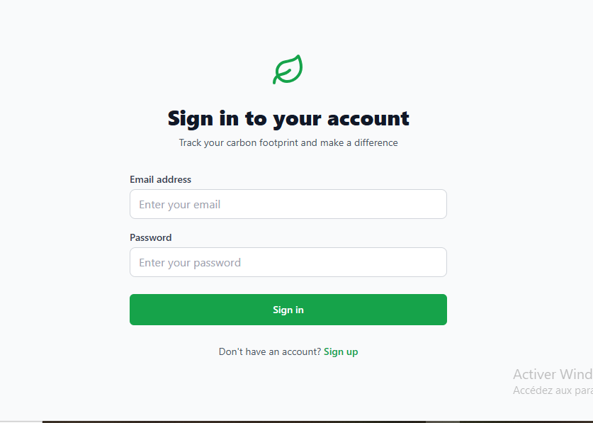
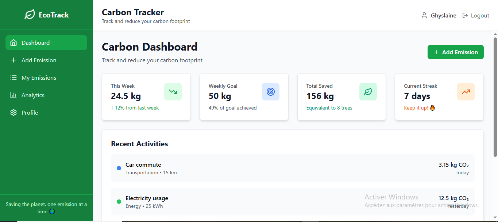
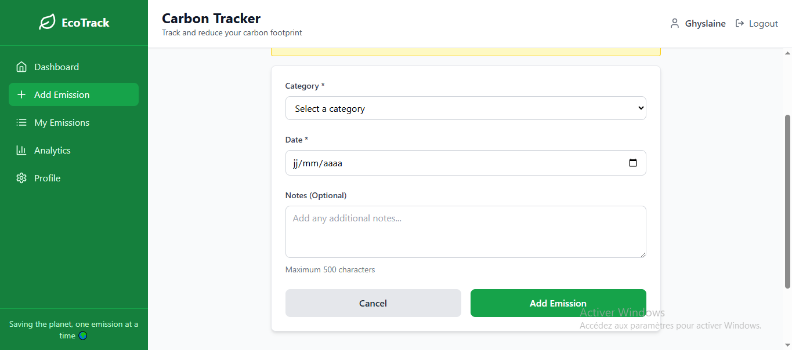
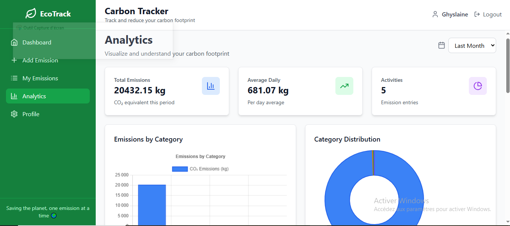
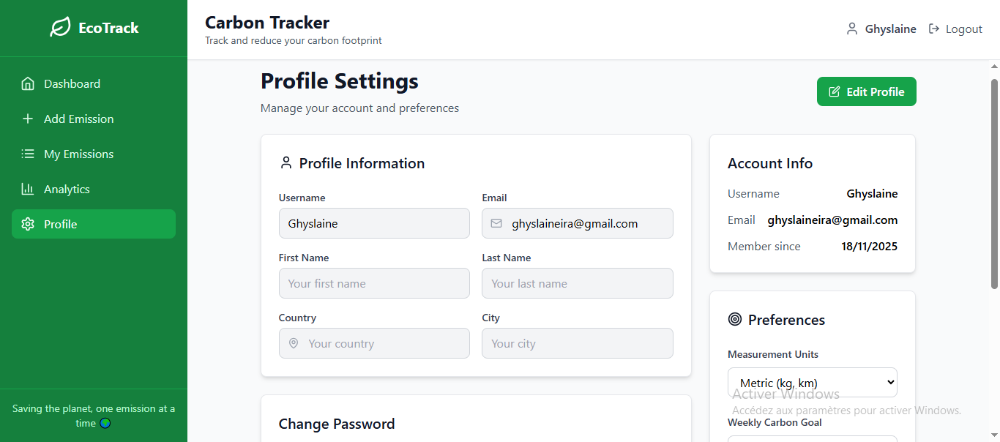

🌱 Carbon Tracker - Carbon Footprint Tracking Application
A modern web application to track and analyze your personal carbon footprint. Built with the MERN stack (MongoDB, Express.js, React, Node.js).

🎯 Key Features
✅ Emission tracking by category (transportation, energy, diet, etc.)

✅ Interactive dashboards with charts and statistics

✅ Secure user authentication

✅ Automatic CO2 equivalent calculations

✅ Modern responsive interface

🚀 Live Deployment
🌐 Live Application
Frontend (Vercel):https://mern-final-project-ghyslaine95.vercel.app/

Backend (Render):https://carbon-tracker-backend-r5ll.onrender.com

Pitch deck(canva):https://www.canva.com/design/DAG5VAPXlrA/LZgPBow39NkIIy_sklNvBw/edit?utm_content=DAG5VAPXlrA&utm_campaign=designshare&utm_medium=link2&utm_source=sharebutton

📸 Screenshots
Homepage and Authentication

Main Dashboard

Add Emissions

Analytics and Charts

Profile

🛠️ Local Installation
Prerequisites
Node.js (v18+)

MongoDB Atlas or local

npm or yarn

Backend Setup
bash
# Clone the repository
git clone https://github.com/Ghyslaine95/mern-final-project.git
cd backend

# Install dependencies
npm install

# Environment configuration
cp .env.example .env
# Edit .env with your variables

# Start the server
npm run dev
Frontend Setup
bash
cd frontend

# Install dependencies
npm install

# Environment configuration
cp .env.example .env
# Edit .env with your variables

# Start the application
npm run dev
Environment Variables
env
# Backend (.env)
MONGODB_URI=your_mongodb_connection_string
JWT_SECRET=your_jwt_secret
JWT_EXPIRES_IN=30d
FRONTEND_URL=http://localhost:5173

# Frontend (.env)
VITE_API_URL=http://localhost:5000/api/v1
🏗️ Technical Architecture
Backend (Node.js/Express)
Framework: Express.js

Database: MongoDB with Mongoose

Authentication: JWT

Security: Helmet, CORS, Rate Limiting

Validation: Express Validator

Frontend (React/Vite)
Framework: React 18

Build Tool: Vite

Styling: Tailwind CSS

Charts: Chart.js

HTTP Client: Axios

Routing: React Router

📊 Supported Emission Categories
Category	Activities	Unit
🚗 Transportation	Car, Bus, Train, Plane	km
⚡ Energy	Electricity, Gas, Heating Oil	kWh
🍽️ Diet	Meat, Vegetables, Dairy	kg
🛍️ Shopping	Electronics, Clothing, Furniture	items
🗑️ Waste	Plastic, Paper, Food	kg
🎨 Detailed Features
🔐 Security
Secure JWT authentication

Password hashing with bcrypt

Configured CORS protection

Rate limiting to prevent abuse

📈 Analytics
Real-time charts (Chart.js)

Statistics by period (week, month, year)

Breakdown by category and activity

Historical trends

📱 User Experience
Responsive interface (mobile-first)

Loading states and user feedback

Comprehensive error handling

Smooth navigation

🤝 Contributing
Contributions are welcome! To contribute:

Fork the project

Create a feature branch (git checkout -b feature/AmazingFeature)

Commit your changes (git commit -m 'Add some AmazingFeature')

Push to the branch (git push origin feature/AmazingFeature)

Open a Pull Request

📝 License
This project is licensed under the MIT License. See the LICENSE file for details.

👤 Author
Ghyslaine

GitHub: @Ghyslaine95

Project: Carbon Tracker

🙏 Acknowledgments
Render for backend hosting

Vercel for frontend hosting

MongoDB Atlas for database

